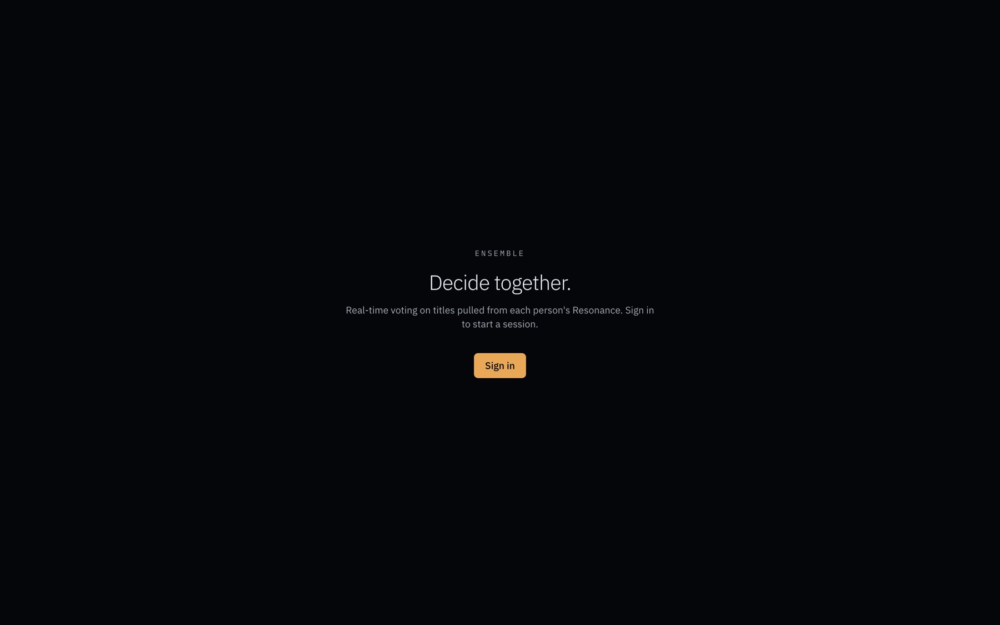

# Ensemble

> Real-time multi-user companion to [Resonance](https://github.com/Drubnerw98/Resonance) and [Constellation](https://github.com/Drubnerw98/Constellation). Two or more users with Resonance profiles pull candidate titles into a shared session, vote with live presence, and converge on what to watch together.

**Live demo: [ensemble-sigma.vercel.app](https://ensemble-sigma.vercel.app)**



Part of a paired ecosystem:

- **[Resonance](https://github.com/Drubnerw98/Resonance)** maps a user's taste DNA into a structured profile and recommends across formats.
- **[Constellation](https://github.com/Drubnerw98/Constellation)** visualizes that profile as a force-directed canvas.
- **Ensemble** (this repo) is the layer where two or more users converge their profiles in real time and decide what to watch, read, or play together.

For the architectural decisions log (every "why did you pick X over Y" call), see **[decisions.md](./decisions.md)**.

## Features

- **Real-time presence and voting.** Liveblocks-backed session sync, optimistic vote toggles, live cursor of who is in the room. Auto-finalize fires when every present member flags Done; the host has a Finalize-now override.
- **Pull candidates from Resonance.** Each member triggers their own "Pull from my Resonance" run. Hybrid mix of library items plus recent recommendations, deduped against what's already in the room and what the puller has already pulled in this session. Host configures items per pull (1-20).
- **Hybrid library plus recommendations mix.** Pulls draw from Resonance's library, watchlist, and recent recommendation batches. Imported titles read as anchors the recommender already named; recommendations carry their full match metadata into the room.
- **Threshold rule per session.** Unanimous, majority, or first-to-N (host-configurable, with a warning when N exceeds present count). Pure threshold evaluator, random pick on simultaneous crossings with a brief spin reveal.
- **Pip-dot threshold meter.** Each candidate row shows a row of dots: filled per vote received, hollow per vote still needed. On consensus cross, the winning row's pips stagger-fill from scale-0 before the row-pulse glow takes over, giving the consensus moment a visible convergence beat.
- **Designed primitive controls.** Custom segmented control for the threshold rule (with framer-motion active-pill animation and arrow-key navigation), custom stepper for N and items-per-pull. No native `<select>` or number `<input>` on the surface.
- **Cross-attribution "why this fits the room" chips.** Each candidate row surfaces other members whose Resonance profile *also* describes this title, with a theme or archetype tag. Built from the lifted shared `titleMatch` matcher, so the same logic powers Resonance's per-rec cross-references and Ensemble's room-aware fit signal.
- **Reactions.** 4-button fixed set (thumbs-up, heart, thinking, yikes) on every candidate row. Toggle-on-tap, disabled when the session locks.
- **TMDB autocomplete plus poster thumbnails.** Manual title entry hits a serverless TMDB proxy (hides the v3 read token, rate-limited via shared Upstash); freeform fallback if no result selected. Resonance pulls are enriched with TMDB metadata before the storage write so posters appear immediately.
- **Member chips with ready state.** Avatar picks up a saffron ring when the user flags Done. Host badge inline, hover surfaces full name plus role plus ready state.
- **Hero card reveal.** Winning candidate animates into a spring-mounted hero card with title, poster, voter stack, and a Reconsider button (host-only) that re-opens voting with votes cleared.
- **Authority migration.** Room creator is host. If they drop, authority migrates to the lowest-connectionId member still present. Host-only mutations check `hostId` defense-in-depth.
- **Ephemeral sessions.** Room code IS the Liveblocks room ID; no mapping layer. Sessions disappear when the last member leaves. MVP-appropriate; persistence is a graduate-when-needed call logged in `decisions.md`.
- **Mobile-first polish.** Stacked candidate rows below the `sm` breakpoint, 44px touch targets via Button primitive shim, single-breakpoint strategy locked in `decisions.md`.

## Stack

| Layer       | Choice                                                            |
| ----------- | ----------------------------------------------------------------- |
| Frontend    | React 19 + TypeScript, Vite 6, Tailwind v4                        |
| Auth        | Clerk (OAuth shared with [Resonance](https://github.com/Drubnerw98/Resonance) and [Constellation](https://github.com/Drubnerw98/Constellation)) |
| Sync engine | Liveblocks (managed, free tier)                                   |
| External    | Resonance API (bearer token), TMDB (proxied)                      |
| Tests       | Vitest + happy-dom + React Testing Library (143 unit tests)       |
| Hosting     | Vercel (SPA + one serverless function for Liveblocks token-mint)  |

## Local setup

Requires pnpm and Node 20+.

```bash
pnpm install
cp .env.local.example .env.local
# fill in VITE_CLERK_PUBLISHABLE_KEY, VITE_RESONANCE_API_URL,
# CLERK_SECRET_KEY, LIVEBLOCKS_SECRET_KEY, TMDB_READ_TOKEN
pnpm dev
```

## Scripts

- `pnpm dev`: Vite dev server.
- `pnpm build`: type-check + production build.
- `pnpm typecheck`: `tsc -b --noEmit` across all tsconfigs.
- `pnpm lint` / `pnpm lint:fix`: ESLint flat config.
- `pnpm format` / `pnpm format:write`: Prettier.
- `pnpm test`: Vitest.
- `pnpm check`: typecheck + lint + build (the CI gate).

## Deploy

Vercel handles both the SPA build and the serverless functions under `api/` automatically. The env vars above must be set on the Vercel project (`VITE_*` for the build step, the others for the function runtime).

## Documentation

- [`architecture.md`](./architecture.md): system shape, data flow, module map.
- [`decisions.md`](./decisions.md): every architectural call with the reasoning. Source of truth for *why*.
- [`CLAUDE.md`](./CLAUDE.md): working rules for Claude Code in this repo.

## How this was built

Ensemble is the third project in a paired build. Resonance shipped first as the AI recommendation system; Constellation shipped second as the visualization layer; Ensemble shipped third as the real-time consensus layer.

Like the other two, Ensemble was built with Claude (the LLM) as a pair-programmer in Claude Code. The implementation work was done in conversation. The architectural calls were mine, logged in `decisions.md` with the reasoning intact. The bar I held the project to: every entry in `decisions.md` is something I can defend live in an interview.

Three calls where I overruled or extended the default the model would have shipped:

1. **Liveblocks managed first, self-hosted Yjs later if and only if the failure mode bites.** The default path for a real-time multi-user app is to spin up a sync server and a CRDT engine immediately. I scoped to the managed free tier so the consensus flow could ship in weeks, not months. The graduation criteria are written down; until they're hit, premature scale is the wrong move.
2. **Room code IS the Liveblocks room ID.** There's no session-to-room mapping table, no opaque session entity. The 6-character code is both the shareable artifact and the storage key. Drops a whole class of "session doesn't match room" bugs by construction.
3. **Ephemeral sessions for MVP.** Sessions disappear when the last member leaves. No history, no past-decisions browse view, no "what did we pick last time" surface. This is the loadbearing scope cut that lets the room feel like a moment, not a thread. Graduates if and only if real users start asking "where did our session go."

The architecture decisions in [decisions.md](./decisions.md) are mine. The implementation under those decisions is paired work. That's the collaboration shape this project is most a portfolio piece of.

## License

Portfolio project; not currently licensed for redistribution.
