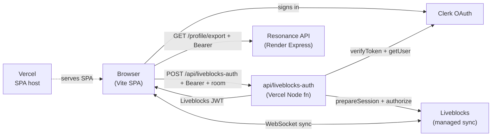
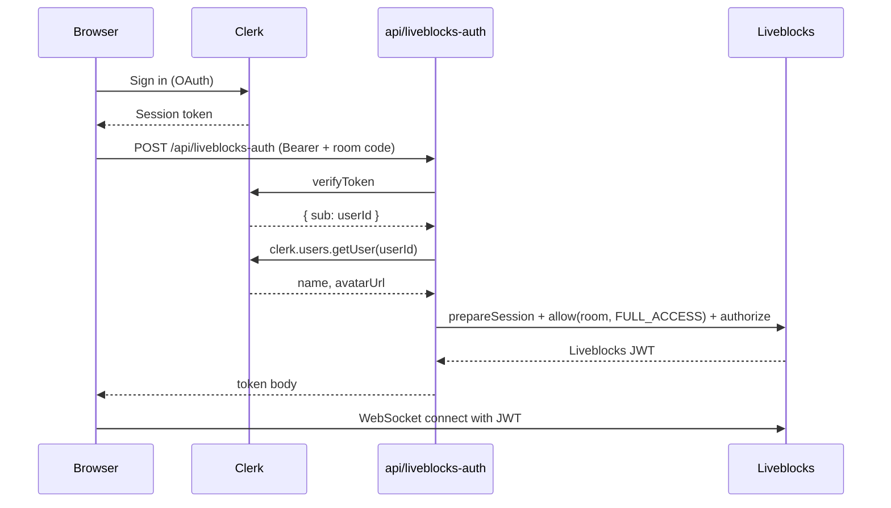

# Architecture

System shape, data flow, and module map. For *why* each piece was chosen, see [`decisions.md`](./decisions.md).

## System overview

Three managed services in the dependency chain. No self-hosted backend.



## Authentication flow

The browser never holds the Liveblocks secret. Every room join is server-verified.



Defense-in-depth at the auth function (`api/liveblocks-auth.ts`):

1. Bearer token must be present (`401` if missing).
2. Clerk verifies the token (`401` if invalid).
3. Room code must match `/^[A-HJKMNP-Z2-9]{6}$/` (`400` if not).
4. User-info fetch is wrapped in try/catch so a transient Clerk hiccup does not block joining; falls back to an `Anonymous` placeholder.

## Session and room model

- The 6-character session code **is** the Liveblocks room ID. No mapping layer.
- Alphabet: `ABCDEFGHJKMNPQRSTUVWXYZ23456789` (31 chars; visually-ambiguous chars I/L/O/0/1 removed so codes are speakable).
- Code space: ~10⁹. Collision is structurally identical to "joining the same session" because the code IS the room ID.
- Ephemeral: when everyone leaves the Liveblocks room, the session is gone. No persistence layer.

The same regex lives in `src/lib/sessionCode.ts` and `api/liveblocks-auth.ts`. The auth function is intentionally self-contained, so the duplication is deliberate. If the alphabet changes, both files need updating.

## Liveblocks Storage schema

Declared in `src/lib/liveblocks.ts` via TypeScript module augmentation, so every Liveblocks hook is typed end-to-end.

The runtime shape evolves with the product; `src/lib/liveblocks.ts` is the source of truth. Today's storage roots are:

- `candidates: LiveList<LiveObject<Candidate>>` — the candidate pool. `Candidate` carries `addedBy` (LiveList of user ids for multi-attribution), `tasteTags` (carried from Resonance items at pull-time for cross-attribution matching), plus optional TMDB metadata.
- `votes: LiveMap<string, LiveList<string>>` — keyed by candidate id, valued by a list of voter user ids.
- `consensus: LiveObject<Consensus>` — host id, threshold rule, phase, winner, candidates-per-pull.
- `reactions: LiveMap<string, LiveObject<Reactions>>` — per-candidate per-kind voter lists for the four-button reaction set.
- `memberProfiles: LiveMap<string, LiveObject<MemberProfileSnapshot>>` — per-member snapshot of themes + archetypes, written on first pull and frozen for the room's lifetime. Drives the cross-attribution chips that show which OTHER members' profiles also describe a candidate.

Presence carries `votingComplete: boolean` for the per-user finalize-voting Done flag.

## Routes

Defined in `src/App.tsx`:

| Path | Signed in | Signed out |
|------|-----------|------------|
| `/` | `<Home>` (create or join) | `<Landing>` |
| `/s/:code` | `<Session>` (Liveblocks room) | `<Landing>` |
| `*` | redirect to `/` | redirect to `/` |

`vercel.json` rewrites everything except `/api/*` and asset files to `/`, so React Router handles deep links on refresh.

## Module map

```
api/
  liveblocks-auth.ts        Vercel Node fn: Clerk verify + Liveblocks token mint

src/
  App.tsx                   routes, signed-in/out gating
  main.tsx                  ClerkProvider + BrowserRouter mount
  components/
    SessionUI.tsx           in-session UI: presence, candidate list (vote UI pending)
  hooks/
    useResonanceProfile.ts  fetch + lifecycle for the signed-in user's Resonance profile
  lib/
    api.ts                  Resonance API client (fetchMyProfile), ApiError
    liveblocks.ts           Liveblocks Storage type augmentation, Candidate type
    sessionCode.ts          generate + validate 6-char codes
  routes/
    Home.tsx                signed-in landing: create or join, profile card
    Landing.tsx             signed-out landing
    Session.tsx             room boot: LiveblocksProvider + RoomProvider, auth endpoint
  styles/                   Tailwind v4 entry CSS
  types/
    profile.ts              ResonanceProfileSnapshot shape
```

## Resonance integration

Read-only. One endpoint currently consumed:

- `GET {VITE_RESONANCE_API_URL}/api/profile/export` with `Authorization: Bearer <Clerk session token>`. Returns the user's themes and archetypes; mapped to `ResonanceProfileSnapshot` in `src/lib/api.ts`.

Resonance enforces user-scoped queries on its side, so Ensemble never threads a `userId` parameter into the call. Errors are normalized through `ApiError`: HTTP 404 surfaces as `state: "no-profile"`, network/CORS failures as a generic "Resonance is unreachable" message.

Future endpoints (e.g. recommendation pulls for candidate seeding, library reads for cross-referencing) will be added to Resonance as separate, controlled changes per the bearer-token decision in `decisions.md`.

## Environment variables

| Var | Side | Purpose |
|-----|------|---------|
| `VITE_CLERK_PUBLISHABLE_KEY` | Frontend | Clerk client SDK |
| `VITE_RESONANCE_API_URL` | Frontend | Base URL of the Resonance API |
| `CLERK_SECRET_KEY` | Server | `verifyToken` + `clerk.users.getUser` in the auth function |
| `LIVEBLOCKS_SECRET_KEY` | Server | Liveblocks Node SDK in the auth function |

`VITE_*` keys are baked into the client bundle at build time. The two server keys must never be `VITE_*`-prefixed.
